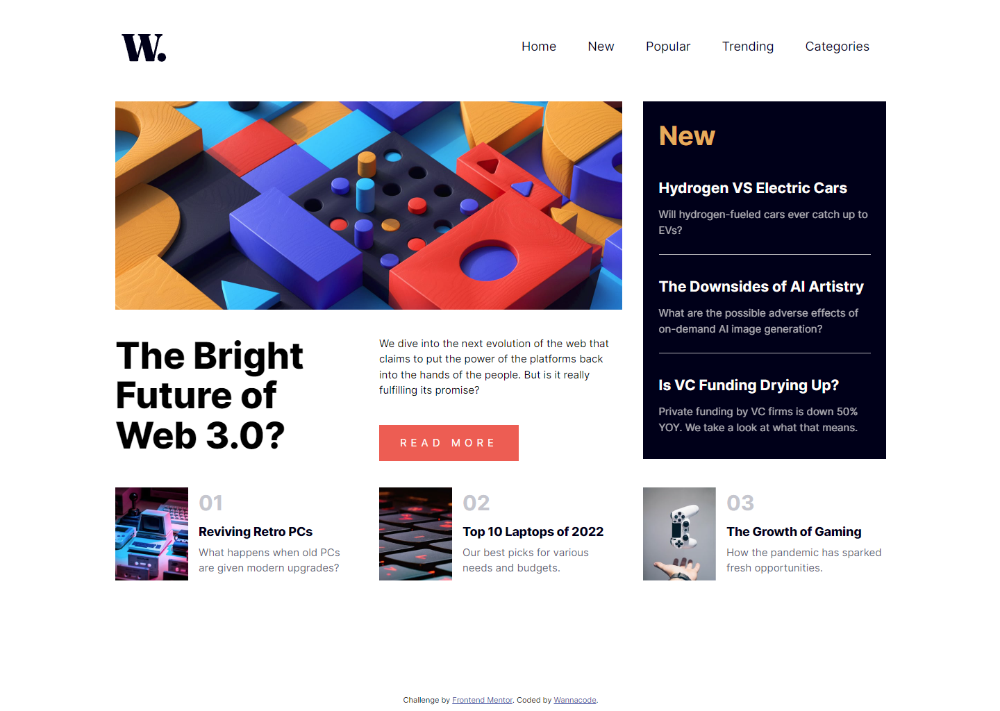
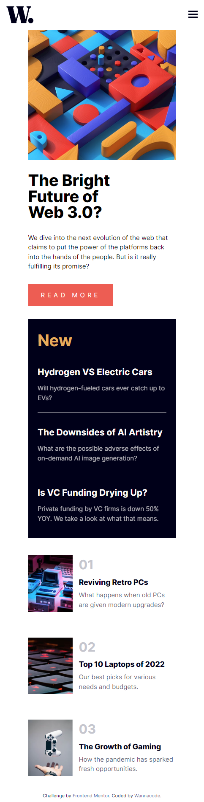
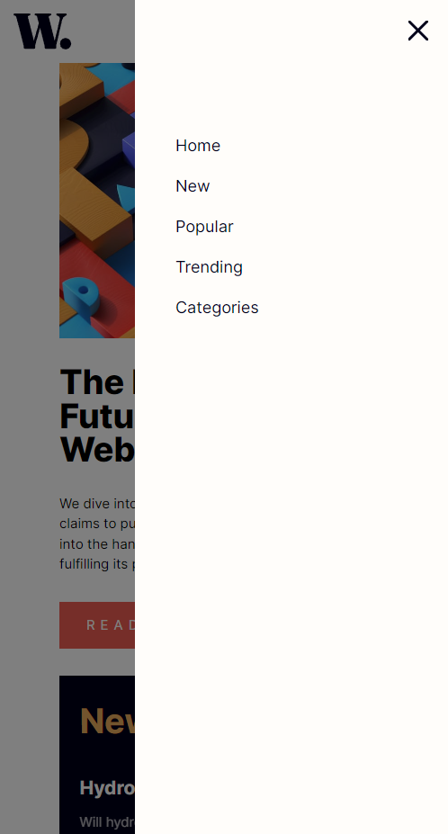

# Frontend Mentor - News homepage solution

This is a solution to the [News homepage challenge on Frontend Mentor](https://www.frontendmentor.io/challenges/news-homepage-H6SWTa1MFl). Frontend Mentor challenges help you improve your coding skills by building realistic projects. 

## Table of contents

- [Overview](#overview)
  - [The challenge](#the-challenge)
  - [Screenshot](#screenshot)
  - [Links](#links)
  - [Built with](#built-with)
  - [What I learned](#what-i-learned)
  - [Continued development](#continued-development)
  - [Useful resources](#useful-resources)
- [Author](#author)
- [Acknowledgments](#acknowledgments)

## Overview

### The challenge

Users should be able to:

- View the optimal layout for the interface depending on their device's screen size
- See hover and focus states for all interactive elements on the page

### Screenshot

### Links

- Solution URL: [Solution URL here](https://github.com/kwngptrl/FEM-news-homepage-solution)
- Live Site URL: [Live site URL here](https://kwngptrl.github.io/FEM-news-homepage-solution/)

### Built with

- Semantic HTML5 markup
- CSS custom properties
- Flexbox
- CSS Grid
- Mobile-first workflow

### What I learned

This is my first major attempt at using CSS Grid, variable fonts, and using moving the reset.css to another CSS file to keep the length down. The navigation bar at the top is working, but not really to my liking. Again, the great Kevin Powell had a similar Youtube video (see links below), from which I utilized and modified slightly because it was causing the mobile menu to slide-in and out when the screen is resized. Other things I learned (with links below):

-Nesting the navbar outside of header.
-Layout flickering when browser is resized, also present on mobile devices.
-Preventing scrolling when mobile menu is active.

As I progress through the Frontend Mentor challenges, several past challenges and code were used in this, like the 'click outside the menu to close' and use of CSS utility classes to hide things. I expect the same in future challenges building upon what was learned previously.

However, I do think I'm taking too long to code this. I expected myself to be faster by now, but sadly I'm not.

### Continued development

I hope to code a better navigation bar moving forward and be faster at laying out things.

### Useful resources

- [Responsive navbar tutorial using HTML CSS & JS](https://www.youtube.com/watch?v=HbBMp6yUXO0) - Kevin Powell's YouTube video. Curiously, this is also a cFrontend Mentor challenge.
- [Don't nest NAV inside HEADER...](https://dev.to/masakudamatsu/don-t-nest-nav-inside-header-do-nest-the-hamburger-menu-button-inside-nav-6cp) - Article on where to put the NAV element, inside HEADER or outside. I also used this pattern which is not the same as in the video above.
- [Layout Flickering On Browser Resize](https://ishadeed.com/article/layout-flickering/) - This is an article about an issue I was also having, wherein the mobile menu was sliding in and out when the browser was resizing, this is also true on a real mobile device. Hence, I ended up removing the transform from the CSS and activating it only with JS. Ahmad Shadeed is an author and developer I check out when I'm having some issues with CSS.
- [Prevent Scroll On Scrollable Elements [JS & CSS]](https://alvarotrigo.com/blog/prevent-scroll-on-scrollable-element-js/) - I have yet to apply anything from this article. This issue here is when the mobile menu is active and you scroll with the mouse button, the X (close) icon and the background beneath also scrolls. The result is doesn't look so good. I used something else, but the close icon shifts a bit in the x-direction when the transform is being applied.

## Author

- Frontend Mentor - [@Wannacode](https://www.frontendmentor.io/profile/kwngptrl)

## Acknowledgments

All credits mentioned above.